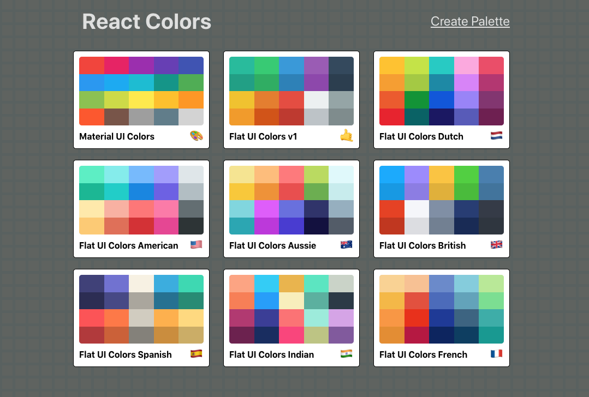
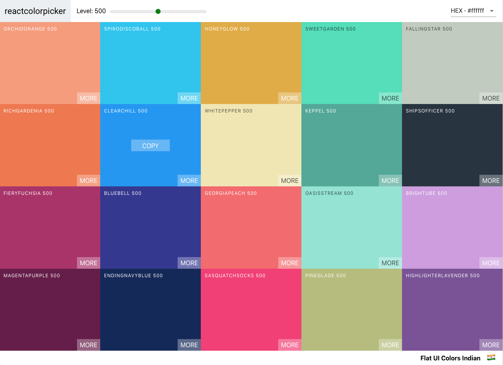
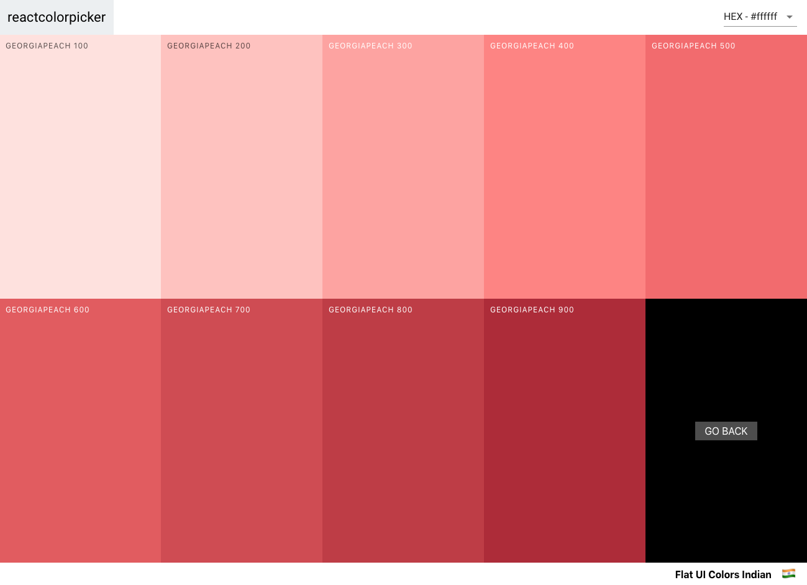
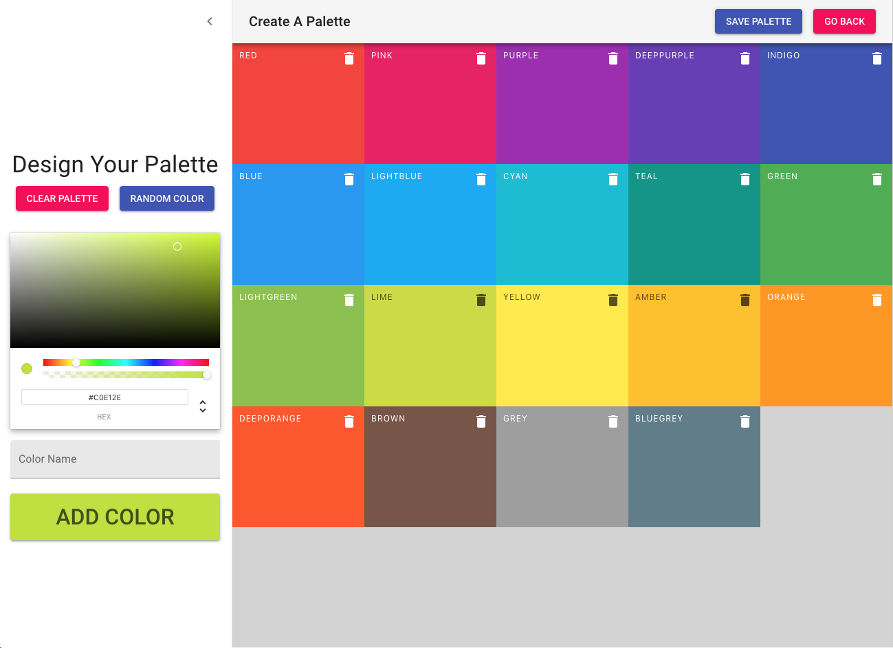

# Color Picker

Front-end app created with React.  Comes with nine default color palettes, or create your own.

When viewing a palette, adjust saturation levels with the slider, click on a color box to save its color value to the clipboard, choose which color format from the drop-down menu, or select "More" to see all saturation values for that color.

When creating a new palette the user is presented with a group of default values.  They can be cleared entirely or individually.  Drag-and-drop color boxes to arrange palette to your liking.  Use the color picker form to create new color boxes (duplicates are prevented).  Save your palette with a name and emoji.

Text and icon color is auto switched between white and black, depending on color box brightness, for improved readability.

Animations and transitions used throughout for improved user experience.  Data is persisted with local storage

### View [working demo](https://color-picker-nds.netlify.com/)

---

### Libraries and services used...
- React (hooks, React Router)
- react-color
- react-copy-to-clipboard
- react-sortable-hoc
- react-transition-group
- chroma-js
- Material UI
- etc...

 

 

 

 

